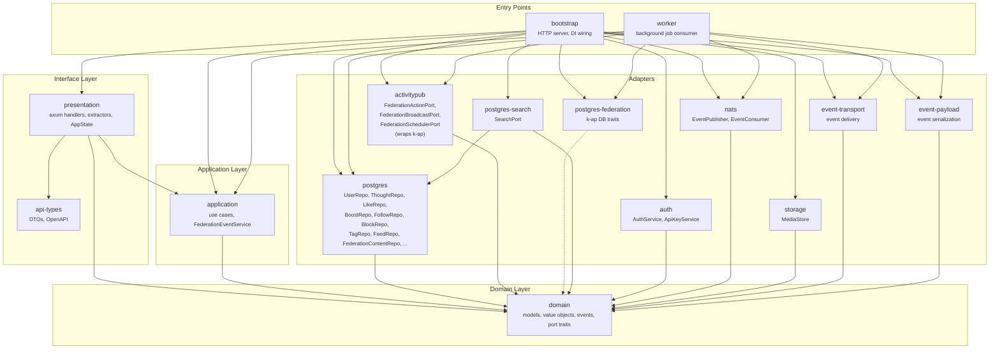
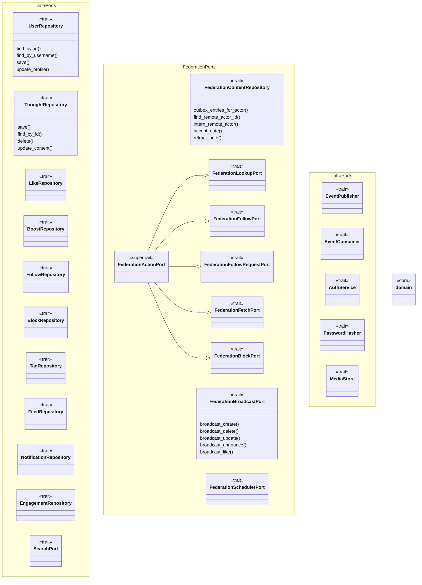

# Architecture

Hexagonal (ports & adapters) architecture. Dependencies point inward — adapters implement domain ports, application orchestrates use cases, presentation handles HTTP.

## Crate dependency graph



## Domain ports



## Dependency rule

```
bootstrap/worker ──► presentation ──► application ──► domain ◄── adapters
```

- **domain** — zero framework deps, pure business logic, defines all port traits
- **application** — orchestrates use cases, depends only on domain
- **presentation** — HTTP handlers (axum), depends on domain + application
- **adapters** — implement domain ports, depend inward on domain only
- **bootstrap/worker** — composition roots, wire adapters into ports
